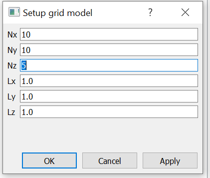

# Hydrogeology Salome Plugin

Plugin for the [SALOME platform](https://www.salome-platform.org/) with which it can be used as preprocessor for the finite element or finite element programs. It writes mesh files in [vtk format](https://vtk.org/wp-content/uploads/2015/04/file-formats.pdf) that can then be read and used by the generic solvers. This plugin was developed to facilitate simulation of several phenomena and scenarios in complex geometries which can not be generated and/or meshed within meshing software, in which we  have been facing during the research project. It is intended to be used for geoengineering purpose.

#### Note:

This plugin is currently work in progress. Furthermore it is more research oriented, which means that the user has to have more knowledge of what is doing. Sorry about that...

***

## Features

* Export mesh and groups created by Salome mesh module into a readable format by finite element code. Various input format are implemented (ASCII file and unstructured grid description). Export directly 3D and 2D groups (boundary faces) as region, in order to easily define material and boundary condition.
* Read a mesh into Salome (only tested in unv and vtk format).
* Useful example (the only one) in the Example folder, to have a quick look at what Salome is capable of.

***

## Getting Started

This plugin was tested on the latest release of Salome (version 9.6.0) which is up to date 9.7.0, running on Ubuntu 20.04 and Windows 10. Nevertheless, it should work for newer release of Salome and for other platform. Note that Salome 8.6.0 uses Python 3 and consequently, the plugin is not compatible as is with Salome version older than 9.2.0. 

This Salome plugin offers two ways of creating models; with and without graphical user interface, the **GUI** (Graphical User Interface) and the **TUI** (Text User Interface, batch) modes respectively. Please see [here](https://www.salome-platform.org/user-section/faq/faq#_faq_003_07) for more details about the TUI mode and [here](https://www.salome-platform.org/user-section/faq/faq#_faq_003_08) to known the differences between GUI and TUI.

### Installation

To install of this plugin is needed three steps:

1. Get and install Salome from <https://www.salome-platform.org/>. The installation, usually,  is just download and unpack it. Please see [here](https://www.salome-platform.org/downloads/current-version) for more information.

2. Get the plugin by cloning this repo or unzip it and copy the content of the folder into `$HOME/.config/salome/Plugins/`, for _Linux_, or `%USERPROFILE%/.config/salome/Plugins/` in _Windows_

3. We need to have install the some modules (plugin dependencies) within Salome, for this we must perform the following steps :

    * Go to your Salome installation folder and open a terminal.
    * Setup the Salome environment with the command:
      * _Windows_

          ```sh
          .\run_salome.exe shell
          ```

      * _Linux_

          ```sh
          ./salome shell
          ```

    * [Download or upgrade](https://pip.pypa.io/en/stable/installation/) the `pip` version of Salome and install the wheel package:

        ```sh
        pip3 install --upgrade pip
        pip3 install wheel
        ```

    * Finally, install the `pyshp` and `scipy` module with the command:

        ```sh
        pip3 install pyshp
        pip3 install scipy
        ```

Now the plugins is installed. You can test it by launching Salome and typing the following command in the TUI: ```import hydrogeo_salome as hgs``` or click in the Salome menu `Tools/Plugin/Hydrogeology Modelling` in order to load the plugin in a GUI mode. This command should not return an error.


***

## Use the plugin

### Creating Mesh

Mesh functionality can be accessed through the `Tools/Plugin/Hydrogeology Modelling/Cartesian Grid Model`, in which purpose to produce one simple form used as base to new functionalities development.

\

Another mesh functionality with purpose to represent topography or geological layers  (top and base horizons) to deal with complex geological structure is accessed in `Tools/Plugin/Hydrogeology Modelling/Grid Model with constraints`.


This functionality can generate complex geological model as shown bellow:
\
Aquifer model with vertical exaggeration 50x, grid model created by TUI command:

```python
import hydrogeo_salome as hgs
o = salome.myStudy.FindObjectByPath('/Mesh/Aquifer').GetObject()
m = o.GetMesh()
ms = hgs.macros.ScaleAlongAxes(m,factor_z=50)
salome.sg.updateObjBrowser()
```

### Add boundary condition

Boundary condition are created by the `Tools/Plugin/Hydrogeology Modelling/Boundary Condition`:


1. Provide the full path of the file containing the regions to assign a boundary condition (uses a shapefile to assign many regions in the same time). The file formats supported:

    * shapefile ".shp" (recomended for several regions)
    * txt ASCII file ".txt" (see [sample file](data/head_regions.txt))
    * comma-separated values (CSV) file with data-tag, x, and y coordinates

2. Define the desired maximun distance (along the x and y directions) to assign the boundary condition to vertices that are close to the region boundary.

3. Define the boundary condition label to be assigned (i.e. Group name).

4. Select a valid SMESH object to add new groups labeled as boundary condition.

5. Check "Only one surface" to mark only the boundary faces located on the model surface (ones with the max(z-coordinate)), otherwise, mark all boundary faces close to and inside regions.


### Export a mesh

To export meshes from Salome:


1. Click on `Tools/Plugin/Hydrogeology Modelling/Export mesh`.

2. Select the mesh you want to export by clicking `Select` and select the mesh in Salome object browser.

3. If you want to export group as boundary regions, click on the corresponding checkbox and use to +/- push-button to add or remove groups. In the exported files, the groups will be labeled by numbers (following the order that are selected).

4. Select the desired output grid format.

    * vtk legacy format
    * MFEM mesh format
    * datablock coordinates (coords) and list of nodes (lnods)

5. Provide an output file

6. Press `OK` to export.

## License

This project is licensed under the MIT License - see the [LICENSE.md](LICENSE.md) file for details

***

## TODO list

* Implement a mesh quality assessment: aspect ratio and skewness check.
* Export 3D and 2D groups in a readily file readable in various format: IMEX/CMG, grdecl, abaqus (BR demands).
* Create a permeability and porosity field dataset generator. Given a 3D mesh group (volume type), create/compute for every cell in the mesh a cell indexed dataset of permeability and store it into a ASCII file.
* Handle with fault geometries. see procedure of [Fisher et al.](https://gmd.copernicus.org/articles/8/3681/2015/gmd-8-3681-2015.pdf)
* Build a geomechanical model from the grid flow model (IMEX/CMG or grdecl).
